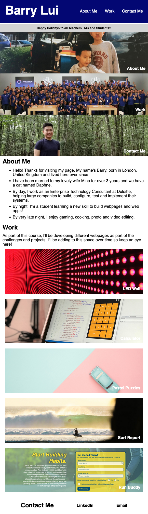
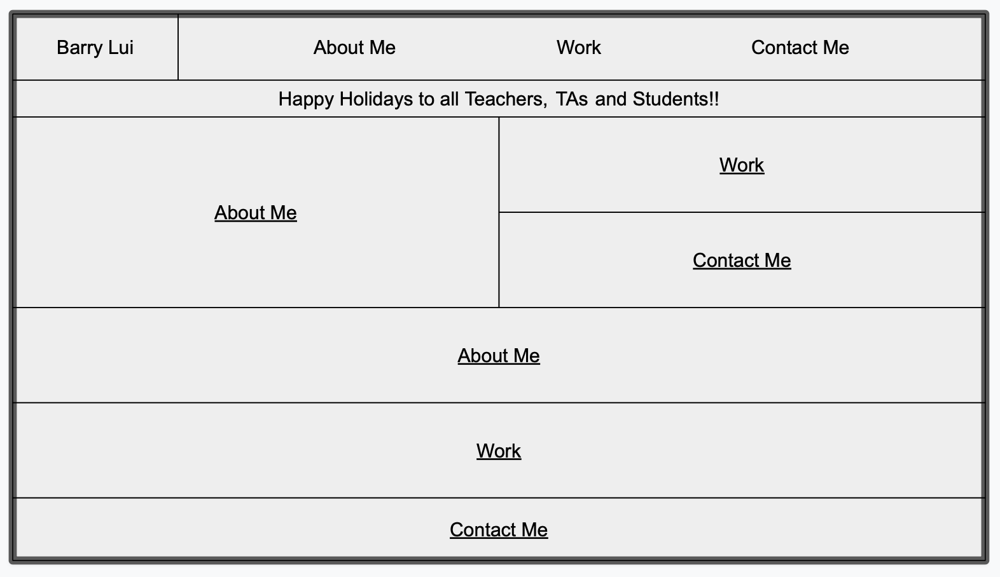
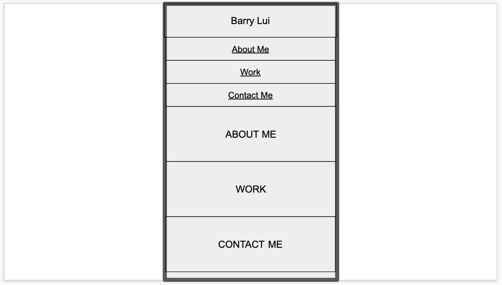

# HTML CSS Portfolio Page for Barry Lui

## Description 

This webpage holds the content for my portfolio. It has been built largely by myself having replaced most of the starter code to support my custom webpage skeleton. It has been a great opportunity for me to apply the knowledge learned over the course of week 2 to build a webpage using CSS Flexboxes, CSS Grids and also implementing media queries to follow best practices.

Following this task, I've certainly enhanced my skills to wireframe and then write HTML and CSS code to build a site that aligns with my wireframe.

One of the challenges I'd like to overcome is understanding how to make things work properly across different browsers. I noticed on Firefox, my webpage looks slightly different to how it does on Safari and Chrome. Additionally, there are challenges around using a Fixed position for navigation bars as it appears to cause content to appear under it. For the purpose of this project, I've worked around this with a 'spacer div' but it isn't optimal as content links appear to take you a bit too low (even though they are behaving as expected).

### Useful Links
[GitHub Repository: HTML-CSS-Portfolio Page](https://github.com/barrylui88/02-HTML-CSS-Portfolio-Page)

[Deployed Page (powered by GitHub Pages)](https://barrylui88.github.io/02-HTML-CSS-Portfolio-Page/)

## Installation

No installation is required - simply follow the URLs I have included above.

## Screenshots

###### Full Webpage Screenshot

###### Narrow Webpage Screenshot

###### Full Wireframe Screenshots

###### Narrow Wireframe Screenshots

## License

MIT License

Copyright (c) 2023 Barry Lui

Permission is hereby granted, free of charge, to any person obtaining a copy
of this software and associated documentation files (the "Software"), to deal
in the Software without restriction, including without limitation the rights
to use, copy, modify, merge, publish, distribute, sublicense, and/or sell
copies of the Software, and to permit persons to whom the Software is
furnished to do so, subject to the following conditions:

The above copyright notice and this permission notice shall be included in all
copies or substantial portions of the Software.

THE SOFTWARE IS PROVIDED "AS IS", WITHOUT WARRANTY OF ANY KIND, EXPRESS OR
IMPLIED, INCLUDING BUT NOT LIMITED TO THE WARRANTIES OF MERCHANTABILITY,
FITNESS FOR A PARTICULAR PURPOSE AND NONINFRINGEMENT. IN NO EVENT SHALL THE
AUTHORS OR COPYRIGHT HOLDERS BE LIABLE FOR ANY CLAIM, DAMAGES OR OTHER
LIABILITY, WHETHER IN AN ACTION OF CONTRACT, TORT OR OTHERWISE, ARISING FROM,
OUT OF OR IN CONNECTION WITH THE SOFTWARE OR THE USE OR OTHER DEALINGS IN THE
SOFTWARE.